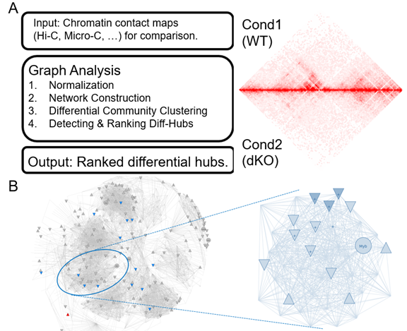

# NOTE: This software is under development.
Latest updated on Jan/14/2021, 

# Comprehensive Network Analysis for HiC

<br><br>

<br><br>


- [Overview](#overview)
- [Documentation](#documentation)
- [System Requirements](#system-requirements)
- [Installation Guide](#installation-guide)
- [Example of Running (Demo)](#Example_Running)
- [License](#license)

## Overview
HicHub is a Python package containing tools for network analysis of HiC data.
It starts from HiC Interaction pairs, then generating network and clustering. Finally ranking all clusters by their interaction change.

## Documentation
The official documentation with usage is under development.

## System Requirements
### Hardware Requirements

This package requires only a standard computer with enough RAM to support the in-memory operations.

### Software Requirements

HicHub mainly depends on the Python scientific stack.

```
python <=3.3
pandas
numpy
pybedtools
python-igraph
scipy
```

## Installation Guide
Recommend to use bioconda for installing.
```
python3 -m pip install hichub --user
python3 -m pip install numpy optparse pandas pybedtools python-igraph scipy
```
```
https://bioconda.github.io/user/install.html
```
Or


## Example of Running (Demo)
Input Format: HiC Interaction in txt format.
Example of test data can be found in ~/test_data

```
#chr	bin1	bin2	Cond1	Cond2
10	3000000	3010000	100	200
```

EXAMPLE: 
```
python igraph_hub.py -i chr10_WT_na-DKO_na.bed -f WT_na -b DKO_na -r 10000 -d 0.5
```

Options:
```
  -h, --help            show this help message and exit
  -i <file>, --in=<file> Path to Input HiC file in txt format
  -f <str>, --foreground_name=<str> Name of condition as foreground.
  -b <str>, --background_name=<str> Name of condition as background.
  -r <int>, --resolution=<int>      Resolution of HiC txt
  -d <float>, --filtered_density=<float> Density cutoff for hub shriking.
```

Output of Hubs:
```
0	1	2	hub_name	Num_vertices	pvalue
chr10	20930000	21060000	chr10:20930000-21060000	11	7.88966007260005e-09
chr10	19590000	19720000	chr10:19590000-19720000	11	7.809766623341443e-05
chr10	80210000	80340000	chr10:80210000-80340000	11	9.520611432439225e-05
chr10	95890000	96030000	chr10:95890000-96030000	14	0.00015075762147303865
```
## Built With

## Contributing

Please read [xx.md](https:xx) for details on our code of conduct, and the process for submitting pull requests to us.

## Versioning

## Authors

* *Xiang Li *Initial work* 


## License

#This project is licensed under the MIT License - see the [LICENSE.md](LICENSE.md) file for details

## Acknowledgments

* Hat tip to anyone who's code was used
* Inspiration

